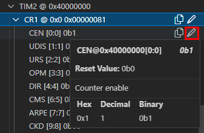

# STM32 Blinky
Blinky on an STM32 Nucleo board built entirely using CMake.

## About the Project
This project is my first exercise completing a fully functional build for an embedded target using the CMake build system.  As I learn more about CMake and setting up build systems, this project will evolve.

Additional goals for this project include:
- [x] Easy to use (as little setup effort as possible)
- [x] Seamless IDE integration
- [x] Automatic management of dev environments
- [x] Cross-platform support (Mac, Windows, and Linux)
- [ ] Reproducable builds that match CI

> **Note:** Although, the xpm dev environment is creating reprodicable builds, there is no CI set up yet, which is why the last goal is not completed.

## Project Status
Blinky is functional for the NUCLEO-L476RG.  Other Nucleo boards could be added, but I haven't created build configurations for them yet.

The project builds using CMake, but there is no proper install target yet.

Build and load has been verified in:
- [x] Windows Git Bash
- [x] Windows Cmd.exe
- [x] Ubuntu in Windows/WSL
- [ ] Native Linux system
- [ ] Mac OS X

## Getting Started

### Prereqs

#### The Basics
To do any type of development, there are a few basic tools you should install.

If you don't already have Git, install that first.  Please see the install instructions for [Linux, Mac and Windows](https://git-scm.com/downloads).  If installing for Windows, this will also install Git Bash.

For code editing and debugging, please install [VS Code](https://code.visualstudio.com/) or [Eclipse CDT](https://www.eclipse.org/cdt/).

> VS Code is the newer, more modern IDE and is gaining widespread popularity.  Although either IDE can be used, this readme's main focus will be VS Code.

**Mac only:** although not needed for this project, it is common for developers to install the [Homebrew package manager](https://brew.sh/).  

#### The xPack Build Framework
This project uses the [xPack Build Framework](https://xpack.github.io/) to manage build tool dependencies.  Please follow xPack's [instructions for installing the prerequisites](https://xpack.github.io/install/).  These instructions have you install `Node.js` and `npm` and then use that to install `xpm`.

> `npm` is Node's package manager.  `xpm` builds on top of `npm`, using Node-style `package.json` files, but is capable of installing binaries needed for building for embedded targets.  Use of `xpm` means you don't need to install CMake, Ninja, or ARM GCC.

**Windows only:** If you do not already have `make` available at your command line, you will need to install it.  The easiest way to do this, if you do not wish to deal with MinGW, MSYS, or Cygwin, is to use `xpm` to install it globally.  
```
xpm install --global @xpack-dev-tools/windows-build-tools@latest
```

**Linux only:** Xpm requires a fairly recent version of node.  If you are on Ubuntu 20.04 LTS, the version of node installed by `apt install nodejs` will be too old.  When installing xpm, you will encounter not-supported errors:  
```
Unsupported engine for xpm@0.13.2: wanted: {"node":">=12"} (current: {"node":"10.19.0","npm":"6.14.4"})
```
I recommend using the recently released Ubuntu 22.04 LTS.  Otherwise, you will probably need to download a `.deb` or `.tar.gz` file directly from nodejs.org.

#### STM32 Development Tools
All NUCLEO boards come with an on-board ST-Link that is used to provide a programming and debug connection.  We will need the necessary drivers and programs to talk to the ST-Link.

Although we are not using it, you will need to install ST's [STM32CubeIDE](https://www.st.com/en/development-tools/stm32cubeide.html).  This is because it provides the necessary programs and drivers to create a debug connection using the ST-Link.

You may optionally install the [STM32 Cube Programmer](https://www.st.com/en/development-tools/stm32cubeprog.html).  This is a standalone program that provides a GUI for erasing, loading, and configuring ST devices.

#### SEGGER J-Link Drivers
_This step is optional._

Rather than installing _STM32CubeIDE_, you can instead convert the on-board ST-Link to a J-Link and use SEGGER's drivers.

First, use [this tool](https://www.segger.com/products/debug-probes/j-link/models/other-j-links/st-link-on-board/) to convert the on-board ST-Link.

Second, install the [SEGGER J-Link drivers](https://www.segger.com/downloads/jlink/) on your system.
 
#### VS Code Extensions
For build and debug using VS Code, the following extensions are required.
- [C/C++](https://marketplace.visualstudio.com/items?itemName=ms-vscode.cpptools)
- [Cortex-Debug](https://marketplace.visualstudio.com/items?itemName=marus25.cortex-debug)
- [xPack C/C++ Managed Build Tools](https://marketplace.visualstudio.com/items?itemName=ilg-vscode.xpack)

The following are optional but not necessary.  They provide syntax highlighting for the non C/C++ files.
- [CMake](https://marketplace.visualstudio.com/items?itemName=twxs.cmake)
- [Arm Assembly](https://marketplace.visualstudio.com/items?itemName=dan-c-underwood.arm)
- [LinkerScript](https://marketplace.visualstudio.com/items?itemName=ZixuanWang.linkerscript)

#### Eclipse
_This section not yet written._

### Building (from the command line)
The following commands can be issued from the project root after cloning the repo.  
- `xpm install`
- `xpm run build --config Debug`

The first command sets up the developer environmment, pulling all of the build tools specified in `package.json`.  _It is only necessary to run this step once after cloning the repo._

The second command runs the build.  This will create `Blinky.elf` and `Blinky.hex` in `build/stm/debug/Src/`.

### Loading

#### If your NUCLEO is configured as an ST-Link
_There is not yet a fully automated mechanism for loading the NUCLEO from the command line._

- Run the build as described above.
- Connect your NUCLEO board.
- Start STM32CubeProgrammer.
- Click the green 'Connect' button in the upper right.  Make sure the status above the 'Connect' button changes to Connected.  If this fails, check that your board is enumerating correclty and/or check the drop-down selection to the left of the 'Connect' button.
- After connecting, on the left-hand set of icons, select the one that looks like an arrow pointing down into a device.  The title above the active area of the GUI should change to "Erasing & Programming".
- For the file path, click 'Browse' and select the `Blinky.hex` file that is in the `build/stm/debug/Src` subfolder.  The `build` folder appears after running the build.
- Select 'Run after programming'.
- Click 'Start Programming'.
- Click the green 'Disconnect' button in the upper right.
 
The board should now be blinking the LED once per second.

#### If your NUCLEO is configured as a J-Link
- Run the build as described above.
- Run `./flash-device.sh` from the root directory of the repo.  (On Windows, this can be done from Git Bash.)
 
The board should now be blinking the LED once per second.

### Build and Debug Using IDEs

#### VS Code
Make sure you have updated VS Code with the necessary extensions described above.

Select _Open Folder_ and select the folder where you cloned this repo.  


Select the Explorer icon in the Activity Bar.  


Underneath the Explorer view, you should see XPACK ACTIONS.  


Run the `install` command.  This will set up the dev environment locally.  This may take a minute so please wait for this to finish.  


Expand the `Debug` configuration and run the `build` command.  This will build the project and create the `Blinky.elf` and `Blinky.hex` output files.  


At this point, VS Code has enough information to update IntelliSense, but you may need to select the configuration.  In the command palette, enter `C/C++: Select a Configuration` and choose `Debug`.  


Open `Src/main.c` and verify there is no red squiggle underneath `#include "stm32l4xx.h"`.  


Set a breakpoint on the first line in `main()`.  


Select the Run and Debug icon in the Activity Bar.  


In the drop-down at the top of the Side Bar, choose `Launch ST-Link` or `Launch J-Link` depending on how your NUCLEO is configured.  


Make sure your NUCLEO board is connected to your comptuer.

Press the green arrow to start debugging.  


Verify you are halted at top of main.  


Note the debug controls that appear above your code editor while the debug session is active.  


From left to right, these are:
- `Reset device` - Resets the device, causing code execution to restart from the beggining.
- `Continue` (run until next breakpoint is hit or execution is paused) -  This button turns into a pause button when the program is running.
- `Step over` - This will execute one line of C source code.  If the line is a function call or includes function calls, those functions will be executed completely.
- `Step into` - If the line is a function call, this will step into the function and halt there.  If it is not a function call, it behaves the same as step over.
- `Step out of` - Will run to the completion of the current function and halt on the next line of the calling function.
- `Restart` - I'm not sure how this is different than `Reset device`.  I would recommend using `Reset device`.
- `Stop` - Disconnect from the debugger and close the debug session.

Follow along with the setup of Timer2 PWM setup.

Step over `SystemClock_Config()` and step into `StartPwmOnPA5()`.  


This function directly accesses the registers of peripherals built into the ST micro.  It does not use a hardware abstraction layer (HAL).  First it accesses peripheral `GPIOA` to assign pin `PA5` (equivalent to Arduino `D13`) to be controlled by the `TIM2` peripheral.

Open the peripheral registers view.  In the command palette, enter `View: Focus on Cortex Peripherals View`.  


In the new peripheral registers view, expand the block for `GPIOA`.  


Single-step the three lines that modify GPIOA and note how `AFRL` and `MODER5` are updated for `GPIOA` in the peripheral registers view.  `MODER5` can be observed by expanding the `MODER` register inside `GPIOA`.

The remaining code sets up the `TIM2` peripheral to operate pin `PA5` with a 1Hz PWM signal.  `TIM2` is receiving the system clock of 80MHz.  It applies a 10k prescalar to `TIM2`, thus operating `TIM2` at 8kHz.  It has the timer count value rollover at 8000, thus giving the PWM signal a frequency of 1Hz.  The duty-cycle is set to 50% by setting the GPIO toggle point (`CCR1`) to 4000.

In the peripheral registers view, expand the block for `TIM2`.  


Single-step the lines that modify `TIM2` and note how the peripheral registers change.

After executing `TIM2->EGR |= TIM_EGR_UG`, note that the green LED is now on solid.  


After executing `TIM2->CR1 |= TIM_CR1_CEN`, note that the green LED is now blinking even though the code is halted.  


Hit `Continue` and `Pause` a few times.  Note that code remains at the `while (1)` loop in `main()` and that pausing and continuing has no apparent affect on the LED blink.  


Manipulate the peripheral registers directly.

With the code paused, expand register `CR1` under `TIM2` in the peripheral registers view and select the edit button for the `CEN` control bit.  This is the enable bit for `TIM2`.  


This opens an edit box to accept a new value.  Enter `0b0` to halt blinking of the LED.  Enter `0b1` to resume blinking.  Note, this will pause (not reset) `TIM2`.  If the LED was on when `0b0` was entered, it will remain on.  If it was off, it will remain off.  `TIM2` will resume the count from wherever it left off when `0b1` is entered.  


#### Eclipse
_Instructions not yet written_

## Need help?
If you need further assistance or have any questions, please file a GitHub issue.

## Future Work
- Add a proper install target possibly using CMake's `install()` command.  I need to explore this further since I don't fully understand `install()` yet.  At the very least, install should be platform agnostic and actually flash the hardware.
- Possibly fix the install script to allow load over ST-Link as well as J-Link.
- Alternatively, add images to the STM32 Cube Programmer instructions so that they are easier to follow.
- Follow up with other things like CI, static analysis, clang formatter, and so forth.

## License
MIT license.  See LICENSE file for details.

## Acknowledgments
A huge shout-out and thanks to Phillip Johnston and the folks at [Embedded Artistry](https://embeddedartistry.com/).
